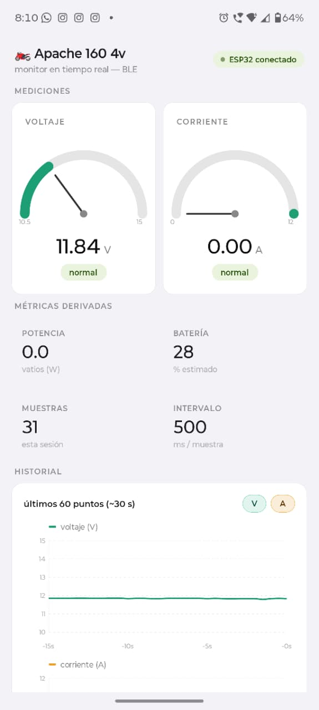
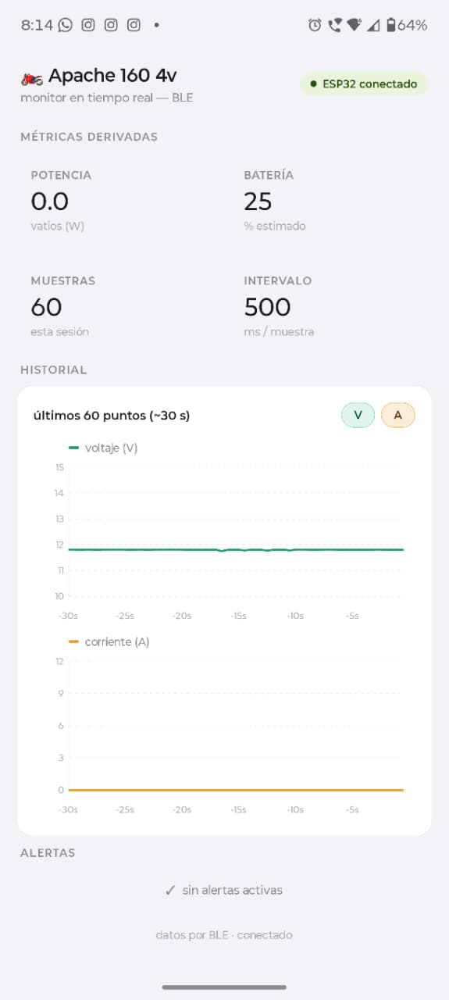
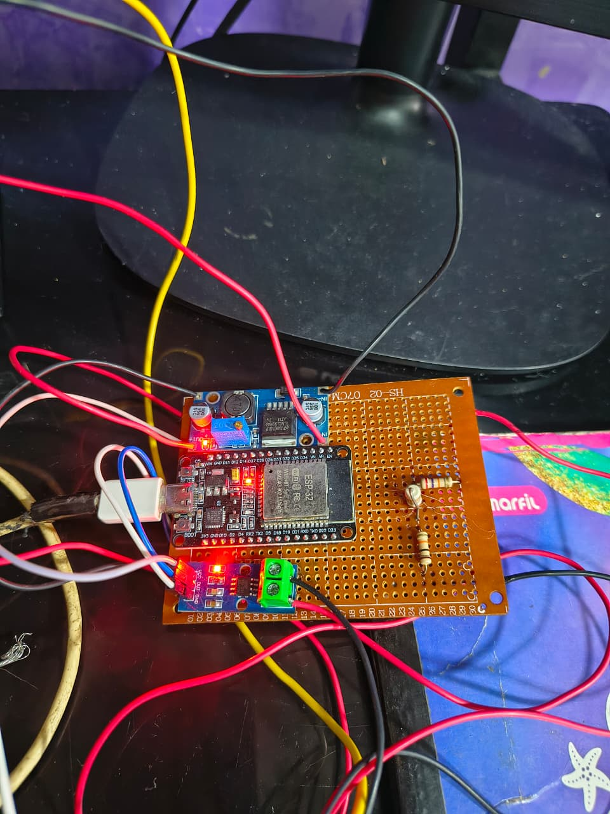

# 🏍️ Monitor de Batería — Apache 160 4v

Monitor en tiempo real del sistema eléctrico de la TVS Apache 160 4v mediante BLE (Bluetooth Low Energy). El ESP32 lee voltaje y corriente, los envía por BLE y la app React Native los muestra en gauges, métricas y gráfica histórica.

---

## 📱 Características

- Conexión BLE automática al encender la moto
- Lectura de voltaje (divisor resistivo) y corriente (ACS712-30A)
- Gauge de voltaje y corriente en tiempo real
- Gráfica histórica de los últimos 60 puntos (~30 segundos)
- Alertas de voltaje crítico, sobrevoltaje y sobrecorriente
- Porcentaje de batería calculado por curva de descarga real
- Reconexión automática si se pierde la señal BLE
- APK instalable generado con EAS Build

---

## 📸 Screenshots

<p align="center">
  
  
</p>

## 🔧 Hardware

<p align="center">
  
</p>

---

## 🗂️ Estructura del repositorio

```
Monitor-de-Bateria/
├── moto-monitor-native/    # App React Native (Expo)
│   ├── src/
│   │   ├── app/            # Pantalla principal (Expo Router)
│   │   ├── components/     # GaugeCard, RealtimeChart, AlertPanel...
│   │   ├── hooks/          # useBLE.js
│   │   └── utils/          # batteryPercent.js
│   └── app.json
└── moto-monitor-ble/       # Firmware ESP32 (Arduino IDE)
    ├── moto_monitor_ble.ino
    └── config.h
```

---

## 🔧 Hardware necesario

| Componente | Descripción |
|---|---|
| ESP32 (cualquier variante) | Microcontrolador con BLE |
| ACS712-30A | Sensor de corriente por efecto Hall |
| LM2596 | Regulador step-down 5V para alimentar el ACS712 |
| Resistor 27kΩ × 2 | R1 del divisor de voltaje (en serie = 54kΩ) |
| Resistor 10kΩ | R2 del divisor de voltaje |
| Cables y protoboard | Conexiones |

---

## ⚡ Diagrama de conexiones

```
Batería 12V ──┬──── R1 (27kΩ + 27kΩ) ──── R2 (10kΩ) ──── GND
              │                        │
              │                     GPIO34 (ESP32) ← lectura voltaje
              │
              └──── ACS712 (línea de corriente) ──── VOUT ──── GPIO35 (ESP32)
                         │
                      LM2596 ──── 5V ──── VCC ACS712
```

**Pines ESP32:**
- `GPIO34` — Voltaje (divisor resistivo)
- `GPIO35` — Corriente (ACS712 VOUT)

**Calibración:**
- `FACTOR_VOLTAJE = 6.4`
- `OFFSET_VOLTAJE = 1.00` (ajustado con multímetro)
- `ACS712_SENSIBILIDAD = 0.066 V/A` (modelo 30A)
- `ACS712_VREF = 2.5V`

---

## 🚀 Cómo flashear el ESP32

### Requisitos
- Arduino IDE 2.x
- Soporte ESP32 instalado (Boards Manager → `esp32` by Espressif)
- Librería **ArduinoJson** (Sketch → Manage Libraries)

### Pasos
1. Abre `moto-monitor-ble/moto_monitor_ble.ino` en Arduino IDE
2. Revisa `config.h` y ajusta los pines y calibración si es necesario
3. Selecciona tu placa ESP32 en `Tools → Board`
4. Conecta el ESP32 por USB y selecciona el puerto
5. Sube el sketch (`Ctrl+U`)
6. Abre el Serial Monitor a `115200 baudios` para verificar

---

## 📲 Cómo instalar y correr la app

### Requisitos
- Node.js 18+
- Expo CLI: `npm install -g expo`
- EAS CLI: `npm install -g eas-cli`
- Android con Bluetooth habilitado

### Desarrollo local
```bash
cd moto-monitor-native
npm install
npx expo start
```

> La app requiere un **Development Build** (no funciona en Expo Go por BLE).

### Generar APK
```bash
eas build --platform android --profile preview
```

El APK se descarga desde el dashboard de EAS y se instala directamente en el celular.

---

## 📡 Configuración BLE

Los UUIDs deben coincidir exactamente entre el ESP32 y la app:

| Variable | UUID |
|---|---|
| `SERVICE_UUID` | `12345678-1234-1234-1234-123456789abc` |
| `CHAR_UUID` | `abcd1234-ab12-ab12-ab12-abcdef123456` |
| Nombre dispositivo | `MotoMonitor` |

---

## 🛠️ Stack tecnológico

**App móvil:**
- React Native + Expo (Expo Router)
- `react-native-ble-plx` — comunicación BLE
- `react-native-svg` — gráfica personalizada
- `base-64` — decodificación de paquetes BLE
- EAS Build — generación del APK

**Firmware:**
- ESP32 + Arduino IDE
- `BLEDevice` / `BLEServer` / `BLE2902` — servidor BLE
- JSON compacto `{"v":12.6,"i":3.2}` dentro del límite de 20 bytes BLE

---

## 👤 Autor

**Boris (Boricuas)** — Técnico en electrónica marina, y estudiante de desarrollo de software, Cartagena, Colombia.

---

## 📄 Licencia

MIT — libre de usar, modificar y distribuir.
